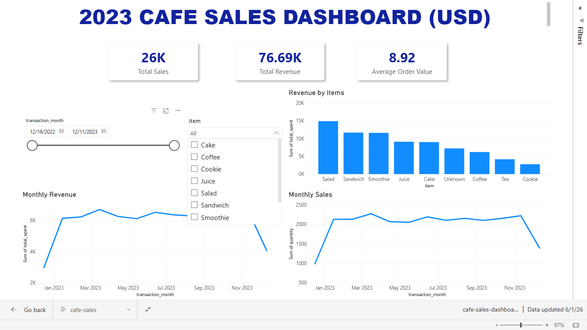

# Cafe Sales Dashboard

---

## Executive Summary

Proyek **Cafe Sales Dashboard** bertujuan untuk menganalisis performa penjualan sebuah kafe sepanjang tahun 2023 melalui proses pembersihan data, eksplorasi bisnis, dan visualisasi interaktif menggunakan PostgreSQL dan Power BI.

Dataset awal mengandung berbagai permasalahan kualitas data, seperti nilai anomali (`ERROR`, `UNKNOWN`, dan `[null]`) yang tersebar pada sebagian besar kolom. Melalui serangkaian proses data cleaning, seluruh nilai anomali distandarisasi, dilakukan perhitungan ulang terhadap nilai transaksi yang tidak konsisten, serta penyaringan data yang tidak memenuhi standar kualitas. Hasilnya, diperoleh **8.596 transaksi valid** yang siap digunakan untuk analisis bisnis.

Analisis menunjukkan bahwa kategori makanan sehat menjadi pendorong utama pendapatan kafe, dengan **Salad** sebagai kontributor revenue terbesar, diikuti oleh **Sandwich** dan **Smoothie**. Sebaliknya, **Cookie** memberikan kontribusi revenue terendah sehingga berpotensi menjadi fokus evaluasi strategi promosi maupun penetapan harga.

Dari sisi tren waktu, performa penjualan selama tahun 2023 relatif stabil. Namun, terdapat fenomena menarik pada periode **Juli–Agustus 2023**, ketika jumlah item yang terjual meningkat tetapi revenue mengalami penurunan. Temuan ini mengindikasikan adanya pergeseran pola pembelian pelanggan menuju produk dengan harga yang lebih rendah, bukan penurunan permintaan secara keseluruhan.

Selain menghasilkan insight bisnis, dashboard ini juga mengungkap pentingnya peningkatan kualitas proses pencatatan transaksi. Masih ditemukannya nilai *Unknown* pada beberapa atribut transaksi menunjukkan adanya potensi kesalahan input maupun masalah sistem yang dapat memengaruhi akurasi analisis di masa mendatang.

Secara keseluruhan, dashboard ini memberikan gambaran menyeluruh mengenai performa penjualan, kontribusi produk, tren pendapatan, serta kualitas data operasional yang dapat digunakan sebagai dasar pengambilan keputusan bisnis yang lebih efektif.

---

## Data Cleaning & Quality Log
* **Inisialisasi & Impor Data:** Pada tahap awal, seluruh kolom di dalam dataset didefinisikan dengan tipe data `TEXT` (`VARCHAR`). Pendekatan ini diambil sebagai strategi preventif karena terdeteksi adanya nilai-nilai anomali seperti `UNKNOWN`, `ERROR`, dan `[null]` pada data mentah.
* **Standarisasi Nilai Anomali:** Ditemukan nilai anomali (`[null]`, `ERROR`, dan `UNKNOWN`) yang tersebar di seluruh fitur, kecuali pada kolom `transaction_id`. Langkah penanganan yang dilakukan adalah melakukan standardisasi seluruh nilai anomali tersebut menjadi satu nilai seragam, yaitu **"Unknown"**.
* **Strategi Tipe Data & Rekayasa Nilai (Imputation):** * Untuk mempertahankan integritas data pada tahap awal, perubahan tipe data tidak langsung dilakukan karena kolom-kolom kritikal masih mengandung nilai string `"Unknown"`.
  * Kolom `price_per_unit` tetap dibiarkan mengandung nilai `"Unknown"` pada beberapa baris khusus, dengan pertimbangan bahwa item tersebut memiliki nilai harga yang identik/sama pada transaksi lain.
  * Dilakukan kalkulasi ulang (*re-computation*) untuk fitur `total_spent`. Jika fitur `quantity` dan `price_per_unit` valid (tidak bernilai `"Unknown"`), maka nilai diperbarui menggunakan rumus: `total_spent = quantity * price_per_unit`.
* **Filtrasi Akhir & Konversi Tipe Data:**
  * Tahap pembersihan akhir menyaring data yang tidak dapat dianalisis. Sekitar **1.404 baris data (14%)** yang mengandung nilai `"Unknown"` pada kolom vital (`quantity`, `total_spent`, atau `transaction_date`) diputuskan untuk **dieksklusi**.
  * Setelah proses filtrasi selesai, kolom `quantity`, `price_per_unit`, dan `total_spent` berhasil dikonversi ke tipe data `FLOAT`, serta kolom `transaction_date` dikonversi ke tipe data `DATE`.
* **Volume Data Akhir:** Setelah melalui seluruh rangkaian *pipeline* pembersihan di atas, diperoleh total **8.596 baris data valid** yang siap digunakan untuk proses analisis mendalam dan visualisasi pada dashboard.

---

##  Dashboard

---

## Business Insights
* **Revenue By Items:**  *Salad* merupakan menu dengan kontribusi revenue tertinggi, diikuti oleh *sandwich* dan *smoothie*, sementara *cookie* menjadi menu dengan kontribusi terendah dengan selisih total revenue terhadap *salad* sebesar 12.11K. Pola ini mengindikasikan bahwa menu berbasis makanan sehat secara konsisten mendominasi penjualan. Di sisi lain, rendahnya kontribusi *cookie* mengindikasikan perlunya *pricing strategy* atau promosi untuk mendorong penjualan item dengan performa rendah.
* **Tren Performa Bulanan:** Secara keseluruhan, revenue dan volume penjualan (items sold) menunjukkan pola yang relatif linear sepanjang tahun 2023. Namun, terdapat anomali pada Juli–Agustus 2023, di mana revenue mengalami penurunan sementara volume penjualan meningkat. Hal ini mengindikasikan adanya pergeseran preferensi pelanggan ke menu dengan harga lebih rendah pada periode tersebut, bukan penurunan minat beli secara keseluruhan.
* **Unknown Values:** Ditemukan sejumlah transaksi dengan nilai Unknown pada kolom item maupun payment method, yang kemungkinan disebabkan oleh human error dalam proses input data maupun kesalahan teknis pada sistem pencatatan. Kondisi ini merupakan catatan serius, mengingat data yang tidak lengkap berpotensi mengurangi akurasi analisis dan keandalan insight yang dihasilkan ke depannya.

---

## Struktur Repositori
* `data/` : Berisi file data mentah (*raw data*).
* `dashboard/` : File dashboard Power BI (`.xlsx`)
* `sql/` : Berisi file sql yang dijalankan untuk cleaning data
* `images/` : Dokumentasi visual atau gambar dashboard untuk keperluan operasional.

## Tools
* PostgreSQL
* PowerBI
